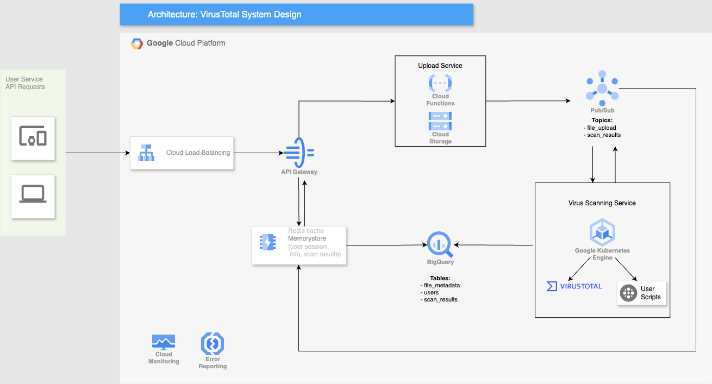

# virustotal-system-design

# VirusTotal Clone System Design

VirusTotal is an online file scanner which checks for malware, while extracting metadata from the uploaded content. It allows  a number of file submission methods, including a web uploader and programmatic API.


[TOC]


# Architecture Diagram


# High Level Overview


1. Authenticated user attempts to upload a file for scanning
2. Load balancer routes the request to an available server
3. Serverless function is triggered an uploads the file to storage
4. Message is sent to a queuing system on successful upload
5. Virus Scanning Service spins up a container to scan the file and run additional user scripts if applicable
6. Metadata about the scan is stored in a persistent database
7. Scan results are returned back to the user


# Services and Tools


* User Service: Front end for user to register and upload files
* Load Balancer: Cloud Load Balancer
* API: API Gateway
* Upload Service: Cloud Function via HTTP Trigger, Cloud Storage Bucket
* Real-Time messaging queue: Pub/Sub
* Database for persistent storage: Bigquery
* User session storage: Memorystore (managed Redis Cache)
* Virus Scanning Service: GKE clusters:
    * VirusTotal scanner
    * Containerized (Docker) user Python scripts
* Monitoring: Cloud Monitoring 
* Error/Failure reporting: Error Reporting


## User Service

Upon a successful registration, that information is persisted into the database and also the cache.


## Cloud Load Balancing

Client Requests are routed across all servers capable of fulfilling those requests in a manner that maximizes speed and capacity utilization, ensuring workload distribution.

If a single server goes down, the load balancer redirects traffic to the remaining online servers. More web servers can be added/removed easily, depending on the traffic load.

Possible LB Algorithms:


* Round Robin: Requests are distributed across the group of servers sequentially.
* Least Connections: A new request is sent to the server with the fewest current connections to clients. The relative computing capacity of each server is factored into determining which one has the least connections.
* **Least Time**: Sends requests to the server selected by a formula that combines the fastest response time and fewest active connections.


## API Gateway

API Gateway is serverless and makes it easy to manage APIs for Cloud Functions, Cloud Run, GKE  and other GCP services. API Gateway includes security features like authentication and key validation as well as monitoring, logging, and tracing. With consumption-based pricing, it’s also easy to manage costs with API Gateway.


### API Authentication

JWT is used for both authentication and authorization as it is a standard for web applications. Upon user login via the User Service, the server (API Gateway) will generate a JWT that contains information about the user (user id, permissions). The JWT is signed using a secret key only known by the server. The server sends the JWT to the client, which can be used to access resources on the server.

Commonly used signing algorithm HS256 which uses the same secret key to create and verify the signature.


## Redis Cache

Memorystore will host a managed Redis cache instance for user authentication, storing session info and returning results back to the user (file scan or scripts). This results in lower latency compared to a persistent database like Bigquery.

Metadata cache servers are replicated; if a node goes down, the data will be available on the next node.

API tokens will be stored for quick authentication and returning the secret access token.


## Upload Service

The Upload Service will upload the file to a GCS bucket using an Eventarc trigger for a Cloud Function. Data in the bucket will be replicated in the same region and cross-region to guard against data loss. **Resumable uploads** are the recommended method for uploading large files over 100MB, because you don't have to restart the upload from the beginning if there is a network failure, while the upload is underway.

File will be kept in standard storage, for high availability. If needed older files can be archived to save costs.

Files will be replicated on the same-region and cross-region to guard against data loss.

The upload service will also push a notification to Pub/Sub with the file storage location, user id  and hash.


## Virus Scanning Service

When the user uploads a file, a message is sent to the Pub/Sub topic, file_upload. This message contains the file info and location. Downstream subscribers within the Virus Scanning Service read the topic and download the file within the message contents.

Within the GKE engine, a pod will run the VirusTotal software to scan the file. Results are sent back to the user and written to the persistent database.


### User Scripts

The end user can write their own script for extracting metadata for downstream analysis. This can be done by the user creating their own bundled Python package and hosting it on a repository of their choice.

When the user uploads a file for scanning, they can specify the additional python package to be executed, and this will spin up a container within GKE. Results will be sent back to the user.

GKE will also support Windows VMs for scanning files in a particular environment.


## Database (BigQuery)

Bigquery will be used to store data within the following tables:


1. file_metadata
2. users
3. user_api_tokens
4. scan_results

Given the scale of the application, the table will combine clustering and partitioning to enhance query performance, intended for BI developers downstream. Clustered tables contain clustered columns which sort data into storage blocks - queries will scan the relevant blocks based on the clustered columns instead of the entire table or partition. Partitioned & clustered tables (in Bigquery) perform better than sharding (See note)

Tables will be partitioned by date and clustered by country and user_id. Multi-region table replication will be enabled to protect against data loss.

**_Note: With sharded tables, BigQuery must maintain a copy of the schema and metadata for each table. BigQuery might also need to verify permissions for each queried table. This practice also adds to query overhead and affects query performance._


## Cloud Monitoring

Metrics for further analysis will be automatically captured. This allows for monitoring of application/service health, as well as performance. Metrics include:


* API: server load for requests/response, latency of request/response, request count
* GKE: avg memory usage, avg cpu usage,  avg container execution time
* Cloud storage upload duration
* Bigquery: query execution count, table size
* Cloud functions: execution count, active instances
* Pub/Sub: ack latency, messages sent, backlog messages per topic

Custom breakdown by date/region/user can be added.

Cloud Monitoring can also be integrated with Prometheus in the future if required for enhanced logging capabilities.


## Error Reporting

Error Reporting counts, analyzes, and aggregates the crashes in your running cloud services. Error notifications will be sent immediately upon an exception. Error reporting also aggregates similar error types together for easier analysis.


## Handling System Failures


* **Load Balancer failure**: A secondary load balancer would become active and route the traffic. Load balancers are monitored via heartbeat signals; if a heartbeat is not sent for a given timeout, the LB is considered dead.
* **API Gateway failure**: Traffic is redirected to another API server by the load balancer.
* **Redis cache failure**: The metadata cache servers are replicated. If a node goes down, another node will take over. Failed nodes also get replaced.
* **Storage service failure**: GCS buckets and its data are replicated over multiple regions to prevent data loss.
* **Messaging service failure**: Pub/Sub is fully managed and supports data replication to 3 zones within a region. Downstream subscribers can also be in any region, even outside of GCP.
* **Database failure**: BigQuery is fully managed, and supports DB replication across regions. If a master node is down, a slave is promoted to master and resumes read/write operations and management. If a slave is down, another slave is used.
* **Kubernetes cluster failure**: GKE is fully managed, and supports integration with Cloud Monitoring to check the health of clusters, nodes and containers. Auto repair automatically repairs a node which fails a health check. Also supports Global load balancing to distribute incoming requests across pools of instances across regions.


# Data Model for Metadata Storage

Tables will be created for storing the following data:


* File metadata
* Results after scanning the file
* User information
* API token for the users

A common theme among the tables is a nested data format; Bigquery has good support for nested/repeated fields as it uses column-oriented storage out of the box. Nested fields denormalize data storage and increase query performance. This data can be added to a staging database, and analytics/BI teams downstream can parse the data for their own business needs.

The file_metadata payload can be modified on the fly, to include or exclude the following file info fields from VirusTotal: [https://docs.virustotal.com/reference/files](https://docs.virustotal.com/reference/files)


## Table: file_metadata


* id
* data
    * file_details
        * md5: <string> file's MD5 hash.
        * sha1: <string> file's SHA1 hash.
        * sha256: <string> file's SHA256 hash.
        * size: <integer> file size in bytes.
        * tags: <list of strings> list of representative attributes.
        * country: <string> country ISO code from which the item was submitted.
        * date_submitted: <integer> submission date as UTC timestamp.
        * city: <string> city name from which the item was submitted.
        * name: <string> filename the item was submitted with.
        * source_key: <string> anonymised token that uniquely identifies a submitter.
        * names: <list of strings> all file names associated with the file.
        * meaninigful_name: <string> the most interesting name out of all file's names.
        * times_submitted: <integer> number of times the file has been posted to VirusTotal.
        * total_votes: <dictionary> unweighted number of total votes from the community, divided in "harmless" and "malicious":
            * harmless: <integer> number of positive votes.
            * malicious: <integer> number of negative votes.
        * type_description: <string> describes the file type.
        * type_extension: <string> specifies file extension.
        * creation_date: <integer> extracted when possible from the file's metadata. Indicates when it was built or compiled. It can also be faked by malware creators. UTC timestamp.
        * downloadable: <boolean> true if the file can be downloaded, false otherwise.
        * first_submission_date: <integer> date when the file was first seen in VirusTotal. UTC timestamp.
        * last_analysis_date: <integer> most recent scan date. UTC timestamp.
        * last_analysis_results: <dictionary> latest scan results. For more information about its format, check the Analysis object results attribute.
        * last_analysis_stats: <dictionary> a summary of the latest scan results. For more information about its format, check the Analysis object stats attribute.
        * last_modification_date: <integer> date when the object itself was last modified. UTC timestamp.
        * last_submission_date: <integer> most recent date the file was posted to VirusTotal. UTC timestamp.


## Table: scan_results


* id
* data
    * date: <integer> Unix epoch UTC time (seconds)
    * execution_id: <integer> Id of the AV execution
    * results <dictionary>
        * antivirus: <string> name of antivirus software
        * version <float> version of antivirus
        * stats: <dictionary> summary of the results field. It's subfields are:
        * confirmed-timeout: <integer> number of AV engines that reach a timeout when analyzing that file.
        * failure: <integer> number of AV engines that fail when analyzing that file.
        * harmless: <integer> number of reports saying that is harmless.
        * malicious: <integer> number of reports saying that is malicious.
        * suspicious: <integer> number of reports saying that is suspicious.
        * timeout: <integer> number of timeouts when analyzing this URL/file.
        * type-unsupported: <integer> number of AV engines that don't support that type of file.
        * undetected: <integer> number of reports saying that is undetected.


## Table: users


* id
* data
    * user_info
        * apikey: <string> account's VirusTotal API key. Only visible for the account's owner. Masked for internal users/developers.
        * user_id: <string> user’s id
        * email: <string> account's email. Only visible for the account's owner and its group's admin.
        * first_name: <string> user's first name. Can be modified by the account's owner.
        * has_2fa: <boolean> whether the user has 2FA enabled or not. Only visible for the account's owner.
        * last_login: <integer> user's last login date as UTC timestamp. Only visible for the account's owner and its group's admin.
        * last_name: <string> user's last name. Can be modified by the account's owner.
        * user_since: <integer> user's join date as UTC timestamp.


## Table: user_api_tokens


* id
* data
    * token_details
        * private_access_token: <string> user’s access token (encrypted)
        * user_id: <string> user’s id
        * date: <integer> create date as UTC timestamp.


# 3rd Party API

As stated under the API Gateway service section, JWT authentication will be used with a HS256 signing algorithm.


### Process


1. Verify the JWT auth for the incoming request. Check user id and access key from Redis cache.
2. Perform operation based on API endpoint being called.
3. Respond back to the user with the results of the operation.


## Upload a File

A standard file upload for scanning by VirusTotal

Sample CURL request:

```

curl --request POST \

     --url https://www.virustotal.com/api/v3/files \

     --header 'accept: application/json' \

     --header 'content-type: multipart/form-data' \

     --header 'authorization: Bearer:  <token>‘

```

Sample response:

```

{

  "data": {

    "type": "analysis",

    "id": "OTFiMDcwMjVjZDIzZTI0NGU4ZDlmMjI2NjkzZDczNGE6MTY1MzY1NDM3Nw=="

  }

}

```


## Download a File

Users can download a file which has been scanned.

Sample CURL request:

```

curl --request GET -L --output file_name\

  --url https://www.virustotal.com/api/v3/files/{id}/download \

 --header 'authorization: Bearer:  <token>‘

```

Sample response:

```

{

  "data": {

    "type": "analysis",

    "id": "OTFiMDcwMjVjZDIzZTI0NGU4ZDlmMjI2NjkzZDczNGE6MTY1MzY1NDM3Nw=="

  }

}

```


## Get a File Report

Users can get info about a file which has been scanned

Sample CURL request:

```

curl --request GET -L --output file_name\

  --url https://www.virustotal.com/api/v3/files/{id} \

 --header 'authorization: Bearer:  <token>‘

```

Sample response:

```

{

  "data": {

    "type": "report",

    "scan_id": "OTFiMDcwMjVjZDIzZTI0NGU4ZDlmMjI2NjkzZDczNGE6MTY1MzY1NDM3Nw=="

   “results”:

	…

  }

}

```
